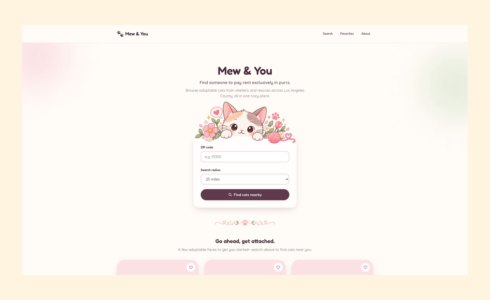
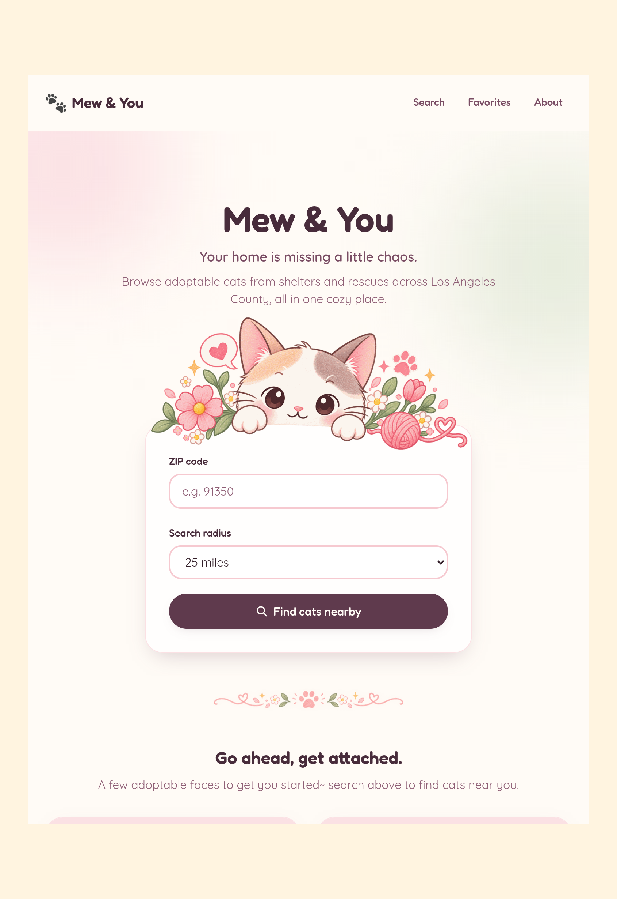
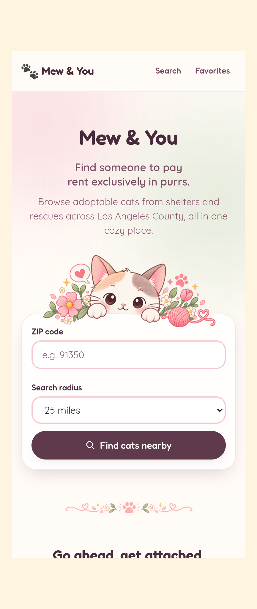

# Mew & You

**Live site:** [https://mewandyou.com](https://mewandyou.com)

A cat-only adoption discovery app that brings adoptable cats from Los Angeles
County shelters and rescues together in one place.



## Features

- **ZIP + radius search** — find cats near a 5-digit ZIP within a chosen mile
  radius
- **Live shelter & rescue listings** — data from [RescueGroups](https://rescuegroups.org/),
  normalized into one shared `Cat` model
- **Distance-aware results** — listings include distance from the search ZIP;
  default sort is closest first
- **Filters & sorting** — age, sex, size, and organization, plus sort by
  distance or name
- **Cat detail pages** — profiles with photo galleries, traits, and links back
  to the listing organization
- **Favorites** — save cats on-device via `localStorage` (no account required)
- **Responsive layout** — built for mobile, tablet, and desktop browsing
- **Accessibility** — labeled forms, pressed-state controls, focus styles, and
  live-region feedback where it matters
- **SEO & social metadata** — page titles/descriptions, Open Graph / Twitter
  tags, canonical URLs, JSON-LD, plus build-time `robots.txt` and `sitemap.xml`
- **Frontend security headers** — HSTS, CSP, framing controls, and related
  headers via Cloudflare Pages `_headers`

## Responsive design

<table>
  <tr>
    <td width="55%">
      
    </td>
    <td width="45%">
      
    </td>
  </tr>
</table>

## How it works

```
Browser  →  Cloudflare Pages (React SPA)
              ├─ static assets + SPA routes
              └─ /api/*  →  Pages Function proxy  →  Render (Express API)
                                                      └─ RescueGroups
```

The frontend always calls same-origin `/api/*`. Locally, Vite proxies those
requests to the API. In production, Cloudflare Pages serves the SPA and a
Pages Function forwards `/api/*` to the Node/Express backend on Render, which
maps RescueGroups animals into the shared `Cat` model the UI already expects.

```
mew-and-you/
├─ frontend/   React + Vite SPA (Cloudflare Pages)
└─ api/        Express API (Render)
```

## Tech stack

| Layer | Stack |
| ----- | ----- |
| Frontend | React 19, TypeScript, Vite, Tailwind CSS, React Router, TanStack Query |
| Backend | Node.js, Express, TypeScript |
| Data | RescueGroups adoptable-pet API (with a local mock provider for development) |
| Hosting | Cloudflare Pages (frontend + `/api` proxy) · Render (API) |

## Running locally

Two terminals:

```bash
cd api
npm install
cp .env.example .env   # add RESCUEGROUPS_API_KEY if using live data
npm run dev            # http://localhost:3001
```

```bash
cd frontend
npm install
npm run dev            # http://localhost:5173 — proxies /api/* to the API
```

By default the API uses `DATA_PROVIDER=mock` (no key required). Set
`DATA_PROVIDER=rescuegroups` and `RESCUEGROUPS_API_KEY` for live listings.

More detail: [`api/README.md`](api/README.md) · [`frontend/README.md`](frontend/README.md)

## Deployment

Production: **Cloudflare Pages** for the frontend, **Render** for the API, with
same-origin `/api/*` preserved by a Pages Function.

See [`DEPLOYMENT.md`](DEPLOYMENT.md) for build commands, environment variables,
SPA routing, the API proxy, and CORS.
